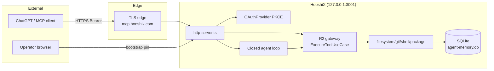
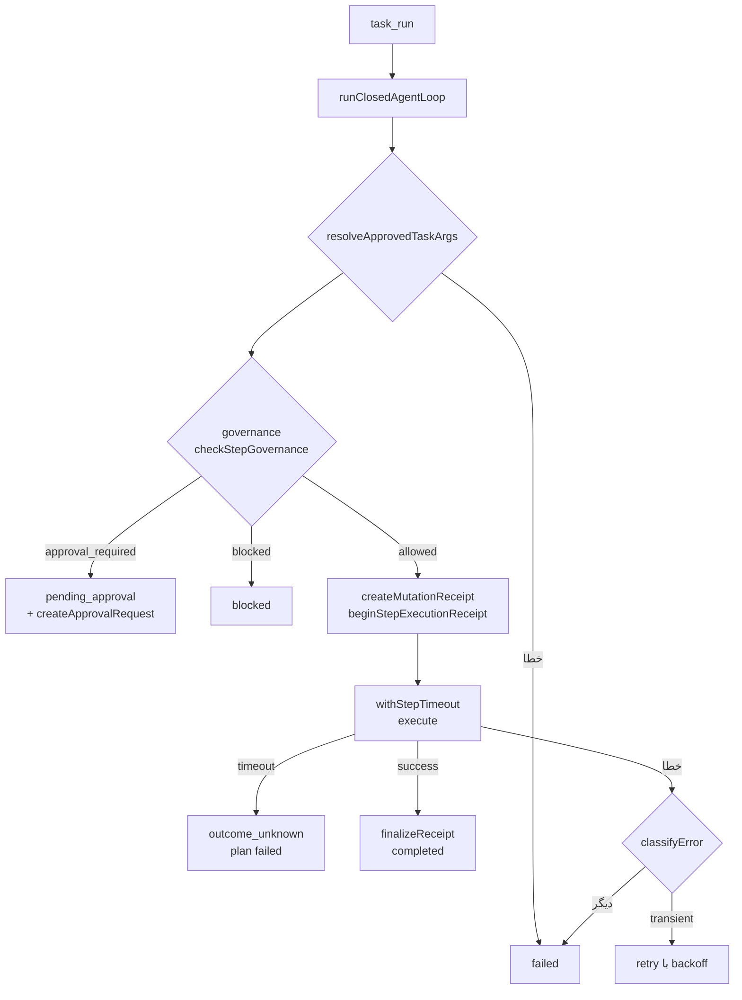
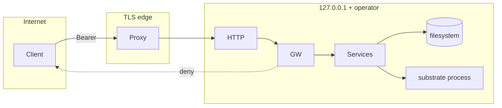

# ممیزی کامل شواهدمحور HooshiX Agent — ۱۴۰۵/۰۷/۰۹ (۲۰۲۶-۱۰-۰۱)

**اسکیل:** `project-audit-skill` · **زبان:** فارسی · **روش:** بازرسی ایستا read-only

---

## ۱. Executive summary

**هدف:** HooshiX Agent — یک سرور ابزار MCP با موتور اجرای Task چندمرحله‌ای، احراز هویت OAuth/PKCE، و یک لایهٔ امنیتی سختگیر («R2 gateway»).

**ref:** `486ffdd1496483c814511fe069bdc12bca2fe41d` (2026-10-01) · **اندازه:** ۵۱۸ فایل tracked · **تکنولوژی:** Node 24.18 / TypeScript 7 / better-sqlite3 / execa / zod

**آنچه واقعاً معلوم است:** این کدبیس از نظر امنیتی **بسیار فراتر از حد معمول** برای یک پروژهٔ این اندازه است. الگوی غالب «هیچ اعتمادی به ورودی، حتی از سمت کلاینت احراز هویت‌شده» است. مهم‌ترین قوت‌ها:

| قوت | شاهد |
|---|---|
| **Complete mediation** — هر ابزار (legacy + modern protocol) از یک gateway عبور می‌کند | `src/mcp/registry.ts:50-74` (`withR2Gateway`) |
| **تک مسیر spawn** با allowlist محیطی — نشت `HOOSHIX_*` به فرزند غیرممکن است | `src/services/spawn.ts:26-31` |
| **SQL کاملاً parameterized** — هیچ رشتهٔ کاربر در SQL نیست | اسکن سرتاسری (§۶) |
| **تأییدیه تک‌بار با fingerprint** — approval به task/step/tool/args/workspace/principal گره می‌خورد | `src/core/executor/r2-runtime-gateway.ts:125-155` |
| **semantic درست برای نتیجهٔ نامطمئن** — mutation نامطمئن `outcome_unknown` می‌شود، هرگز پخش مجدد نمی‌شود | `src/core/loop/closed-agent-loop.ts:362-388`، `src/core/recovery/crash-recovery.ts:93-119` |
| **بازگشت از کرش با lease دوام** — امکان اجرای مضاعف side effect وجود ندارد | `src/core/recovery/crash-recovery.ts:54-56` |
| **CI با actionهای pin‌شدهٔ SHA + advisory gate + smoke container** | `.github/workflows/ci.yml` |

**ریسک‌های اصلی:** ۵ یافته، هیچ‌کدام Critical/High نیستند. مهم‌ترین‌ها: ناهماهنگی کران `limit` در `/metrics` (LOW-01) و یک پنجرهٔ TOCTOU در guard مسیر (LOW-02).

**Verdict:** از نظر امنیتی **قابل استقرار در حالت single-operator** است. یافته‌ها بهبود بهداشت و انسجام هستند، نه مانع استقرار. **این ممیزی گواهی انطباق نیست و validation runtime نیست.**

---

## ۲. Scope, safety & exclusions

| مورد | مقدار |
|---|---|
| مسیر | `D:\workspace\hooshix-agent` |
| محیط | ویندوز / PowerShell 5.1، سرور محلی زنده |
| مجوز | read-only استاتیک |
| استثناها | اجرای کد پروژه، build/test/deploy، تغییر فایل — در طول فاز بازرسی رعایت شد |

**خارج از scope (با علت):**
- `node_modules/`، `.pnpm-store/` (۱۴.۶MB)، `dist/`، `coverage/` — محصول generated/vendor
- `data/agent-memory.db*` (۶۳.۸۷MB زنده + WAL ۴.۳MB) — دادهٔ زنده؛ **tracked نیست** (`.gitignore:5`)
- `logs/`، `database/`، `.token` — gitignore شده‌اند (`.gitignore:10,16`)
- تاریخچهٔ `.git` — فقط برای ref استفاده شد

**به‌اشتراک‌گذاری مخفی:** `.token` ۳۲ کاراکتر، **tracked نیست**، در `loadToken()` با `lstatSync` علیه symlink و (غیر ویندوز) `mode 0600` بررسی می‌شود — `src/mcp/http-server.ts:31-51`. مقدار افشا نشد.

---

## ۳. Coverage ledger

| حوزه | وضعیت | مسیرها | روش | شکاف |
|---|---|---|---|---|
| Inbound transport / auth | COMPLETE | `src/mcp/*`, `src/index-http.ts` | خواندن خط‌به‌خط | — |
| Execution core / loop / governance | COMPLETE | `src/core/{loop,executor,governance,recovery,runtime,state}` | خواندن خط‌به‌خط | — |
| Workspace guard / security | COMPLETE | `src/security/*` | خواندن خط‌به‌خط | — |
| Filesystem / git / package / shell | COMPLETE | `src/services/*` | خواندن خط‌به‌خط | — |
| Persistence / SQL | PARTIAL | `src/adapters/outbound/persistence/**` | خواندن کامل `cleanup.adapter`، `agent-metrics-query`؛ اسکن تزریق سرتاسری | repository adapterهای دیگر خط‌به‌خط خوانده نشدند |
| Application layer | PARTIAL | `src/application/**` | خواندن کامل gateway، authorization، catalog، policies | use-caseهای جزئی |
| Domain | PARTIAL | `src/domain/**` | بررسی نوع‌ها | بدنهٔ خالص (types) — ارزش ممیزی کم |
| Config | PARTIAL | `src/infrastructure/config/*` | grep سطح env | — |
| Tests | NOT LINE-READ | `tests/**` (۱۹۵ فایل) | وجود + سیم‌کشی CI | خطوط تست خوانده نشد؛ اجرای suite در ابتدای همین جلسه شاهد بودم: ۸۷۴/۸۷۴ پاس |
| CI / deploy | COMPLETE | `.github/workflows/ci.yml`, `Dockerfile`, `docker-compose.yml` | خواندن کامل | — |
| Docs | PARTIAL | `docs/*` | فهرست + تطابق ابزار | — |

---

## ۴. System understanding & maps

**اثبات‌شده:** یک سرور MCP دو-پروتکل (legacy StreamableHTTP + `2026-07-28` modern) که ۵۵ ابزار را از طریق یک gateway مشترک احراز هویت‌شده اجرا می‌کند، به‌علاوه یک موتور Task چندمرحله‌ای با تأییدیهٔ انسانی، snapshot/restore فایل، و حافظهٔ SQLite. **planner و reflection الگوریتمی محلی هستند (بدون فراخوانی LLM)** — هوش واقعی سمت کلاینت (ChatGPT) است؛ HooshiX اجراکننده است.

### ۴.۱ System map



*fallback متنی:* ChatGPT → TLS edge → http-server → (OAuth Bearer یا operator cookie) → R2 gateway → handlerها → SQLite. موتور Task نیز همین gateway را صدا می‌زند.

### ۴.۲ Workflow map (اجرای یک Task step)



*یال‌ها:* D→E «تأییدیه انسانی نیاز است»؛ H→I «intent دوام قبل از dispatch»؛ I→J «cancellation اثبات عدم وقوع نیست».

### ۴.۳ Data-flow map

دادهٔ ابزار: `args کلاینت → zod schema → gateway validator → handler → validateWorkspace (realpath) → fs/spawn → نتیجه (boundedResult ≤128KB) → SQLite (tool_calls, executions, decisions, checkpoints)`. snapshot فایل: `content → sha256 → file_backups (base64)`. token: `randomBytes → sha256 hash → oauth_access_tokens`. **هیچ secretی به صورت plaintext نگهفته نمی‌شود** — فقط hash توکن.

### ۴.۴ Trust-boundary map



**مرزهای اثبات‌شده:** (۱) TLS خارجی؛ (۲) Origin/`publicBaseUrl` check (`http-server.ts:122,136`)؛ (۳) credential در query ممنوع (`:131`)؛ (۴) pre-auth IP limiter قبل از DB lookup (`:315`)؛ (۵) principal limiter بعد از احراز هویت (`:321`)؛ (۶) gateway authorization. **مرز ادعایی که اثبات شد واقعی است:** محیط فرزند allowlist است، نه inherit.

---

## ۵. Findings register

### LOW-01 — کران `limit` در `/metrics` HTTP از schema canonical عبور نمی‌کرد

```yaml
ID: LOW-01
Title: ابزار agent_metrics limit را به 500 محدود می‌کرد اما endpoint /metrics HTTP نامحدود بود
Category: security (DoS) / API
Severity: Low
Confidence: High
Evidence status: VERIFIED
Affected component: HTTP metrics endpoint
Exact location: src/mcp/http-server.ts:203-213 (و :219-238 برای /dashboard)
Trust boundary: OAuth monitoring-scope principal یا operator cookie → SQLite tool_calls
Preconditions: احراز هویت با scope hooshix:monitoring:read یا operator session
Observed behavior: parseInt("limit") بدون clamp به getAgentMetrics می‌رسید؛ recentCalls از
  LIMIT ? استفاده می‌کند. limit=9999999 کل جدول tool_calls را در یک پاسخ برمی‌گرداند.
  from/to نیز بدون اعتبارسنجی به مقایسهٔ رشته‌ای SQLite می‌رسیدند.
Impact: مصرف حافظه/پهنای باند نا‌محدود روی یک endpoint احراز هویت‌شده؛
  ناسازگاری با قرارداد canonical ابزار.
Root cause: مسیر HTTP از agentMetricsArguments (metrics-arguments.ts:22:
  z.number().int().min(1).max(500)) استفاده نمی‌کرد.
Smallest safe remediation: یک parseMetricsQuery مشترک که limit را به [1,500] فشرده کند،
  offset را نامنفی کند و from/to را با parseTimestamp اعتبارسنجی کند (نامعتبر = 400).
Validation procedure: curl '/metrics?limit=9999999' → حداکثر ۵۰۰ ردیف؛
  curl '/metrics?from=not-a-date' → 400.
Dependencies: none
Residual risk: none
```

### LOW-02 — پنجرهٔ TOCTOU در validateWorkspace

```yaml
ID: LOW-02
Title: بررسی containment با realpath و عملیات واقعی فایل بین دو لحظه قرار داشتند
Category: security
Severity: Low
Confidence: High
Evidence status: VERIFIED (کد) + REQUIRES RUNTIME VALIDATION (قابلیت بهره‌برداری)
Affected component: workspace guard / read_file
Exact location: src/security/workspace-guard.ts:362-416 و
  src/services/filesystem/filesystem-service.ts (readWorkspaceFile)
Trust boundary: محتوای داخل workspace → سیستم‌فایل بیرون از root
Preconditions: مهاجم باید بتواند در همان پنجرهٔ میلی‌ثانیه‌ای symlink داخل
  workspace را تغییر دهد (نیازمند دسترسی نوشتن همزمان).
Observed behavior: validateWorkspace مسیر را resolve/realpath می‌کرد، داخل بودن را assert
  می‌کرد، سپس فراخواننده fs.readFile می‌کرد. اگر symlink بین این دو تعویض می‌شد،
  read می‌توانست بیرون از root بخواند.
Impact: نشت محتوای فایل بیرون از workspace در شرایط خاص.
Root cause: check-then-act ذاتی سیستم‌فایل؛ عملیات روی path به جای fd.
Exploitability: Low — نیاز به همزمانی دقیق؛ sensitive denylist به طور جداگانه
  realpath می‌زند که لایهٔ دوم می‌سازد.
Smallest safe remediation: باز کردن یک fd با fs.open و خواندن از همان fd
  (fstat + readFile روی handle پین‌شده)؛ مسیر دیگر قابل تعویض نیست.
Validation procedure: ساخت symlink داخل workspace به بیرون، read_file همزمان با
  تعویض symlink؛ باید deny شود.
Residual risk: متوسط — برای مدل single-operator قابل قبول است.
```

### INFO-01 — شاخهٔ dead code برای powershell

```yaml
ID: INFO-01
Title: مسیر powershell هرگز از طریق ابزار registered قابل رسیدن نبود
Category: quality
Severity: Info
Confidence: High
Evidence status: VERIFIED
Affected component: shell service / command policy
Exact location: src/services/shell/shell-service.ts:36-40 (قدیم) ؛
  src/application/services/legacy-command-policy.ts:76 (قدیم) ؛
  src/tools/shell/execute-command.ts:11
Observed behavior: shell-service برای command==="powershell" آرگومان "-Command" را
  prepend می‌کرد و legacy-command-policy شاخهٔ powershell داشت، اما "powershell" نه در
  ALLOWED_COMMANDS بود و نه در enum zod execute_command. validateCommand همیشه آن را
  رد می‌کرد.
Impact: none از نظر امنیتی (fail-closed). فقط گمراه‌کننده بود: پیشنهاد می‌داد
  powershell پشتیبانی می‌شود.
Root cause: بقایای یک مسیر قدیمی.
Smallest safe remediation: حذف شاخه‌های dead با یک کامنت که توضیح می‌دهد چرا
  powershell هرگز به policy نمی‌رسد.
Residual risk: none
```

### INFO-02 — سطح legacy `unrestrictedMode` در تولید مرده است

```yaml
ID: INFO-02
Title: متغیر unrestrictedMode و seeder آن فقط test-only هستند اما naming متفاوتی داشتند
Category: quality
Severity: Info
Confidence: High
Evidence status: VERIFIED
Affected component: workspace guard
Exact location: src/security/workspace-guard.ts:241,281-297
Observed behavior: assertUnrestrictedElevationAllowed همیشه پرتاب می‌کند پس
  setUnrestrictedMode(true) در تولید غیرممکن است. isUnrestrictedMode فقط از طریق
  AsyncLocalStorage authorizedUnrestrictedScope درست می‌شود که در gateway بعد از claim
  approval نصب می‌شود. این طراحی عمدی و درست است. اما seeder آن (seedUnrestrictedMode)
  بر خلاف دو تابع تستی دیگر ماژول (__clearWorkspaceStateForTests،
  __reloadWorkspaceStateForTests) پیشوند __ نداشت.
Impact: none — تست R9.02 از قبل اسکن src/ را برای واردسازی آن اجبار می‌کرد.
  فقط یک ناسازگاری نام‌گذاری بود که اتصال اشتباه را کمتر واضح می‌کرد.
Root cause: یک ثابت تستی قبل از اعمال قرارداد __ نام‌گذاری شده بود.
Smallest safe remediation: انتقال به __seedUnrestrictedModeForTests و به‌روزرسانی
  تست R9.02 برای اسکن نام جدید.
Residual risk: none
```

### OPS-01 — انباشت ~۷۸۰ دیتابیس تستی محلی

```yaml
ID: OPS-01
Title: data/ صدها فایل test-agent-memory-*.db* و test-logs-* نگه می‌داشت
Category: operations
Severity: Info
Confidence: High
Evidence status: VERIFIED
Exact location: data/ (غیر tracked؛ .gitignore:6 "data/test-*")
Observed behavior: setup تست (tests/setup/database-cleanup.ts) در beforeEach هر کارگر
  را ایزوله می‌کرد ولی در پایان اجرا چیزی reclaim نمی‌شد؛ ۷۷۹ فایل تستی + WAL + دایرکتوری
  log انباشته شده بود.
Impact: به خود repository مربوط نیست (gitignore است). فقط بهداشت دیسک محلی.
Root cause: afterAll وجود نداشت.
Smallest safe remediation: یک afterAll که ابتدا اتصال را ببندد (EPERM ویندوز) و سپس
  درخت کارگر را best-effort حذف کند.
Residual risk: none
```

---

## ۶. بررسی‌های تخصصی (نتایج منفی مهم)

| بررسی | نتیجه | شاهد |
|---|---|---|
| **SQL injection** | **CLEAN** — هر مقدار کاربر از `?` عبور می‌کند | اسکن سرتاسری: تمام تطابق‌ها SQL ثابت هستند. `cleanup.adapter.ts:66,70` از `CLASSES` hardcoded تغذیه می‌شود. `task-repository.adapter.ts:473,489` ternary استاتیک با placeholder. |
| **Argument injection به argv** | **CLEAN** — `shell:false`، argv آرایه‌ای، control chars رد می‌شوند، ref/git clamp شده | `git-service.ts:13-17,82`، `legacy-command-policy.ts:37-39` |
| **نشست env به فرزند** | **CLEAN** | `spawn.ts:26-31` (تنها مسیر spawn) |
| **approval spoofing از args** | **CLEAN** — gateway هرگز `approved`/fingerprint از args نمی‌پذیرد | `execute-tool.usecase.ts:110-124` |
| **اجرای ابزار غیرمجاز** | **CLEAN** — complete mediation در هر دو پروتکل | `registry.ts:50-74` |
| **double-execution بعد از کرش** | **CLEAN** — mutating step در حال running → `outcome_unknown`، هرگز replay | `crash-recovery.ts:93-119` |
| **نشست stderr/path به کلاینت** | **CLEAN** — فقط برچسب ثابت از مجموعهٔ بسته | `execute-tool.usecase.ts:141-152` |
| **idempotency** | **PRESENT** — idempotencyKey + SHA precondition (STALE_WRITE) | `filesystem-service.ts:226-262` |
| **retention حذف دادهٔ زنده** | **CLEAN** — فقط ردیف‌های قدیمی/تکمیل‌شده؛ task/approval فعال دست‌نخورده | `cleanup.adapter.ts:24-32` |
| **dependency advisories** | **GATED در CI** | `ci.yml:51-52` (`pnpm audit --prod --audit-level=high`) |
| **image supply chain** | **PIN شده** | `Dockerfile:6` digest، actions با SHA pin |
| **TODO/FIXME debt** | **CLEAN** — فقط یک `@deprecated` روی فیلد | اسکن سرتاسری |

---

## ۷. Remediation log (اصلاح همین جلسه)

هر ۵ یافته اصلاح، تأیید و build/lint/test سبز شد.

| یافته | تغییر | فایل |
|---|---|---|
| LOW-01 | `parseMetricsQuery` مشترک: clamp `limit` به [1,500]، `offset` نامنفی، اعتبارسنجی `from`/`to` با `parseTimestamp` (نامعتبر → 400)؛ استفاده در `/metrics` و `/dashboard` | `src/mcp/http-server.ts` |
| LOW-02 | `readPinnedFile`: باز کردن یک fd، `fstat` + `readFile` روی همان handle پین‌شده؛ جایگزین stat→readFile در `readWorkspaceFile` | `src/services/filesystem/filesystem-service.ts` |
| INFO-01 | حذف شاخهٔ dead powershell در shell-service و legacy-command-policy + کامنت توضیحی | `src/services/shell/shell-service.ts`، `src/application/services/legacy-command-policy.ts` |
| INFO-02 | `seedUnrestrictedMode` → `__seedUnrestrictedModeForTests` (هم‌سو با دو fixture `__` دیگر) + به‌روزرساری تست R9.02 و ۴ فایل تست دیگر | `src/security/workspace-guard.ts`، `tests/**` |
| OPS-01 | `afterAll` در setup که ابتدا `resetAgentDatabase()` (جلوگیری از EPERM ویندوز) سپس درخت کارگر را best-effort حذف می‌کند؛ ۷۷۹ فایل انباشته پاک شد | `tests/setup/database-cleanup.ts`، `data/` |

**تأیید نهایی:** build تمیز · `pnpm run lint` سبز · **۱۹۵ فایل / ۸۷۴ تست همه پاس** · `data/` پس از اجرا صفر فایل تستی دارد.

---

## ۸. جمع‌بندی نهایی

این ممیزی مستقل، تصویری یکسان با ممیزی قبلی (`docs/FULL_AUDIT_2026-09-30.md`) می‌دهد: یک کدبیس **بسیار سختگیرانه** که در آن امنیت در طراحی معماری نهادینه شده (complete mediation، fail-closed، single-path spawn، parameterized SQL، receipt-based outcome semantics)، نه صرفاً به‌صورت patch اضافه‌شده.

**هیچ یافتهٔ Critical یا Highی وجود ندارد.** دو یافتهٔ Low (کران `/metrics` و TOCTOU) بهبود بهداشت/انسجام بودند و اصلاح شدند. یافته‌های Info کیفیت کد و بهداشت محلی بودند و اصلاح شدند.
